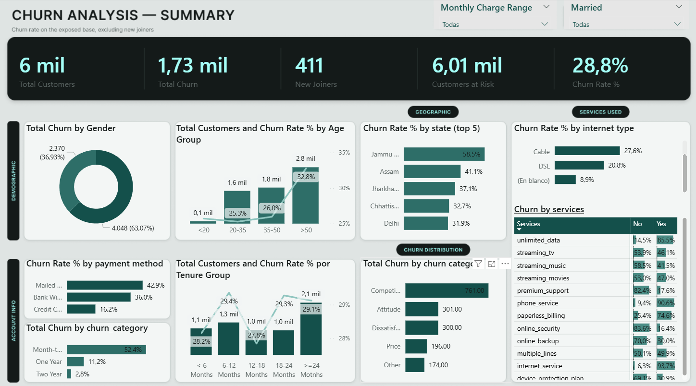
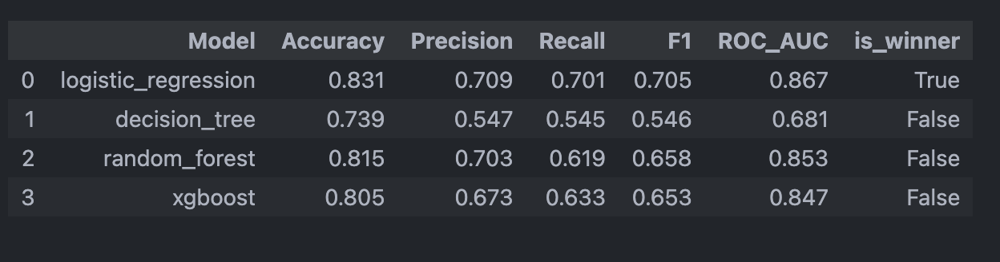
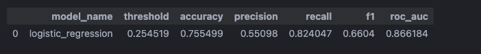
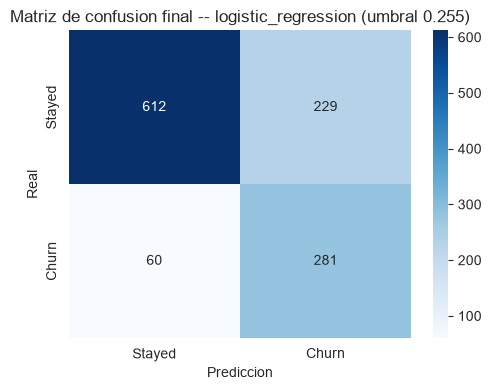

# Customer Churn Analysis Portfolio

Proyecto end-to-end para analizar churn de clientes, construir una arquitectura
analitica reproducible y priorizar clientes con riesgo de abandono.

El flujo cubre ingesta de datos, transformaciones con dbt, analisis
exploratorio, entrenamiento de modelos, seleccion de umbral operativo y una
capa final para consumo en Power BI.

## Demo Visual




## Resultados Principales

| Area                                                       |           Resultado |
| ---------------------------------------------------------- | ------------------: |
| Clientes en dataset fuente                                 |               6,418 |
| Clientes con desenlace conocido (`Stayed` + `Churned`) |               6,007 |
| Clientes con churn historico                               |               1,732 |
| Churn rate historico                                       |               28.8% |
| Clientes`Joined` puntuados por el modelo                 |                 405 |
| Clientes predichos como churn                              |                 280 |
| Modelo final                                               | Logistic Regression |
| Umbral operativo                                           |              0.2545 |
| Recall final                                               |              0.8240 |
| ROC AUC final                                              |              0.8662 |

El modelo se optimizo para priorizar recall, ya que en un caso de retencion es
preferible identificar mas clientes en riesgo aunque aumenten los falsos
positivos.

## Arquitectura Medallion


```text
CSV fuente
  -> Databricks Bronze
  -> dbt Silver
  -> dbt Gold
  -> notebooks de Machine Learning
  -> dbt ML
  -> Power BI
```

La capa Bronze conserva el dato crudo. Silver normaliza nombres y tipos. Gold
agrega variables analiticas para BI. La capa ML publica scores, metricas,
matriz de confusion, curva ROC e importancia de variables para el dashboard.

## Modelo Final



## Modelo Optimizado



## Matriz de confusion



Variables mas influyentes del modelo final:

- `Monthly_Charge`
- `Contract_Month-to-Month`
- `Contract_Two Year`
- `Value_Deal_Deal 5`
- `Age`

## Estructura del Repositorio

| Ruta           | Contenido                                              |
| -------------- | ------------------------------------------------------ |
| `data/`      | Dataset fuente y salidas procesadas del pipeline ML    |
| `notebooks/` | Flujo analitico del`01` al `09`                    |
| `sql/`       | Scripts de Databricks para catalogos, Bronze y capa ML |
| `dbt/`       | Modelos Silver, Gold, ML, sources y tests              |
| `models/`    | Modelos entrenados serializados                        |
| `img/`       | Capturas y graficos usados en la documentacion         |
| `docs/`      | Documentacion oficial del proyecto                     |

## Como Reproducir

Instalar dependencias:

```bash
uv sync
```

Ejecutar notebooks:

```bash
uv run jupyter lab
```

Ejecutar dbt:

```bash
cd dbt
dbt build
```

El pipeline de notebooks debe correrse en orden, porque las salidas de
`data/processed/` alimentan la capa ML y el dashboard.

## Documentacion

- [Ingenieria de datos](docs/data-engineering.md)
- [Modelado e insights](docs/modeling-and-insights.md)
