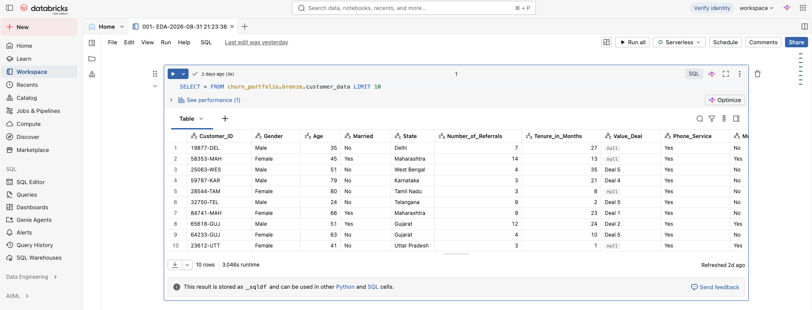
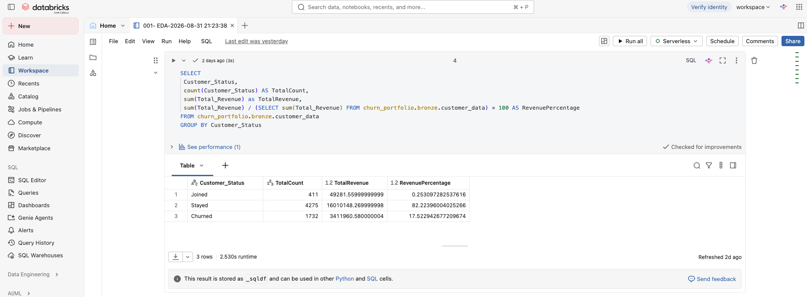
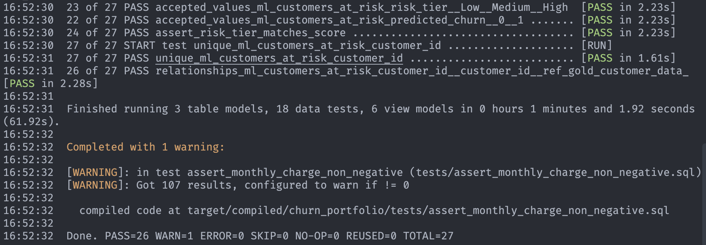

# Ingenieria de Datos

Este documento resume la parte de ingenieria del proyecto: ingesta,
transformaciones, arquitectura medallion, modelos dbt y controles de calidad.

## Objetivo

Construir una base analitica reproducible a partir de `data/Customer_Data.csv`
para responder preguntas de churn historico, perfil de clientes y prediccion de
clientes nuevos.

## Fuente de Datos

| Elemento            |                      Valor |
| ------------------- | -------------------------: |
| Archivo fuente      | `data/Customer_Data.csv` |
| Filas               |                      6,418 |
| Columnas            |                         32 |
| Clientes`Stayed`  |                      4,275 |
| Clientes`Churned` |                      1,732 |
| Clientes`Joined`  |                        411 |

La columna objetivo es `Customer_Status`, con tres estados:

- `Stayed`: cliente con desenlace conocido que permanece.
- `Churned`: cliente con desenlace conocido que abandono.
- `Joined`: cliente nuevo, sin desenlace conocido; se usa para scoring.

## Arquitectura Medallion

```text
data/Customer_Data.csv
  -> churn_portfolio.bronze.customer_data
  -> churn_portfolio.silver.silver_customers
  -> churn_portfolio.gold.gold_customer_data
  -> churn_portfolio.gold.gold_customer_services
  -> churn_portfolio.ml.*
```

### Bronze

La capa Bronze se crea con `sql/001-create-catalog.sql`.

Responsabilidad:

- Crear el catalogo `churn_portfolio`.
- Crear schemas `bronze`, `silver` y `gold`.
- Cargar el CSV crudo como tabla Delta en
  `churn_portfolio.bronze.customer_data`.

La tabla Bronze conserva el dato lo mas cercano posible al origen.

### Silver

Modelo principal: `dbt/models/silver/silver_customers.sql`.

Responsabilidad:

- Renombrar columnas a `snake_case`.
- Mantener una fila por cliente.
- Conservar atributos demograficos, geograficos, servicios, contrato, cargos y
  estado del cliente.
- Marcar la anomalia `has_negative_monthly_charge`.

Tests relevantes:

- `customer_id` unico y no nulo.
- `customer_status` limitado a `Joined`, `Stayed`, `Churned`.
- `churn_category` validado para clientes `Churned`.

### Gold

Modelos principales:

- `dbt/models/gold/gold_customer_data.sql`
- `dbt/models/gold/gold_customer_services.sql`

Responsabilidad de `gold_customer_data`:

- Crear `churn_flag`.
- Crear rangos de cargo mensual.
- Entregar una tabla central para metricas y segmentacion en BI.

Responsabilidad de `gold_customer_services`:

- Despivotar atributos de servicios.
- Crear una vista con grano cliente-servicio.
- Facilitar analisis de adopcion de servicios en Power BI.

### ML

Los notebooks generan salidas en `data/processed/`. Luego
`sql/003-create-ml-layer.sql` las carga en Bronze y dbt las publica en el
schema `ml`.

Modelos dbt de la capa ML:

| Modelo                          | Uso                                     |
| ------------------------------- | --------------------------------------- |
| `ml_customers_at_risk`        | Scores de churn para clientes`Joined` |
| `ml_model_candidates`         | Comparacion de modelos candidatos       |
| `ml_model_metrics`            | Metricas finales del modelo desplegado  |
| `ml_model_confusion_matrix`   | Matriz de confusion del modelo final    |
| `ml_model_feature_importance` | Variables mas influyentes               |
| `ml_model_roc_curve`          | Puntos de la curva ROC                  |

## Calidad de Datos

Controles y decisiones visibles en el proyecto:

- `Customer_ID` se valida como unico y no nulo en dbt.
- `Customer_Status` se valida contra valores aceptados.
- `Monthly_Charge < 0` se marca como anomalia. El dataset contiene 107 filas en
  esa condicion.
- Los clientes con cargos mensuales negativos se excluyen del entrenamiento y
  scoring del modelo.
- La capa ML valida que `risk_tier` y `predicted_churn` sean consistentes con
  `churn_risk_score`.

## Reproducibilidad

Comandos principales:

```bash
uv sync
uv run jupyter lab
cd dbt
dbt build
```

Orden esperado del flujo:

1. Cargar `Customer_Data.csv` en Bronze.
2. Ejecutar `dbt build` para Silver y Gold.
3. Ejecutar notebooks `01` a `09`.
4. Cargar salidas de `data/processed/` en Bronze ML.
5. Ejecutar `dbt build` para publicar modelos ML.
6. Consumir tablas Gold y ML desde Power BI.

## Evidencia Visual

### Databricks





### Dbt Build


