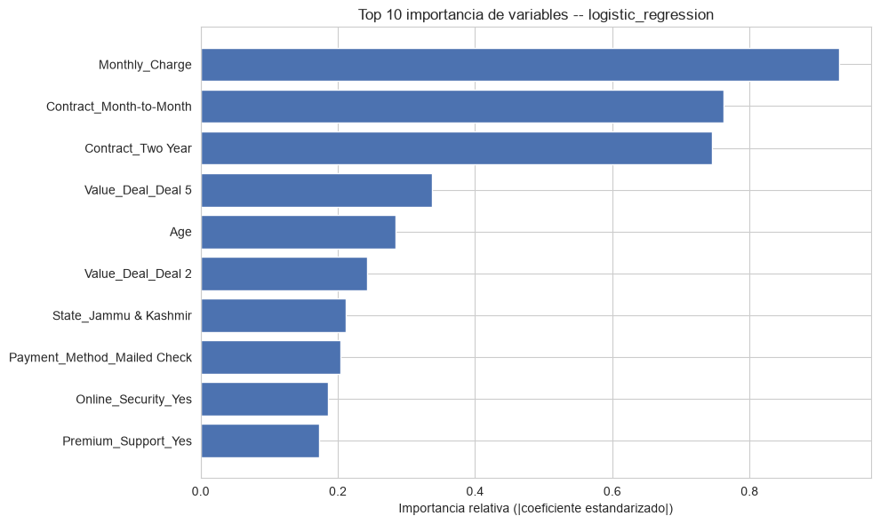
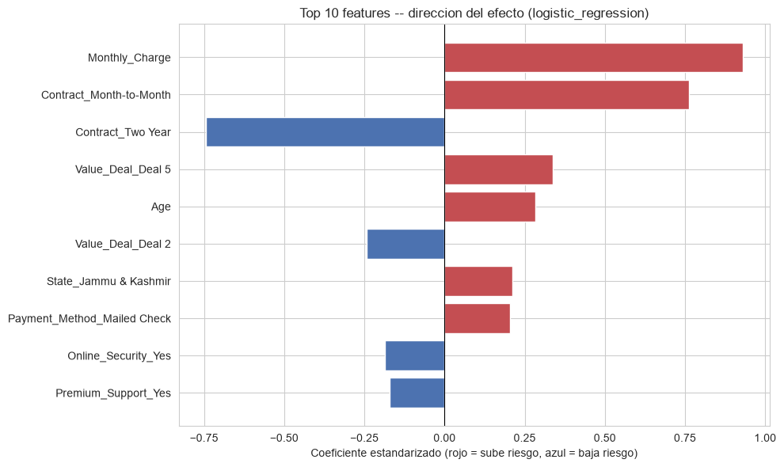
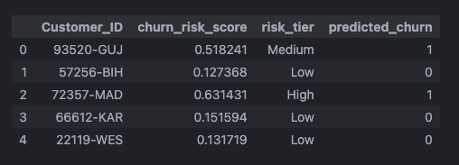

# Modeling and Insights

This document summarizes the analytical and Machine Learning side of the
project: EDA, data preparation, model comparison, threshold selection, and
business results.

## Analytical Objective

The project seeks to answer three questions:

1. How does historical churn behave by customer profile.
2. Which variables help explain higher or lower churn risk.
3. Which new customers (`Joined`) should be prioritized for retention
   actions.

## Notebook Flow

| Notebook                        | Role                                               |
| ------------------------------- | -------------------------------------------------- |
| `01_load_data.ipynb`            | Loading, structure, nulls, target, and duplicates  |
| `02_eda.ipynb`                  | EDA, churn by segment, anomalies, and associations |
| `03_statistical_analysis.ipynb` | Statistical tests and association strength         |
| `04_train_test_split.ipynb`     | Cleaning, leakage control, and split               |
| `05_feature_engineering.ipynb`  | One-hot encoding fit only on train                 |
| `06_modeling.ipynb`             | Training of candidate models                       |
| `07_model_evaluation.ipynb`     | Model comparison                                   |
| `08_final_model.ipynb`          | Tuning, operational threshold, and final metrics   |
| `09_business_insights.ipynb`    | Scoring, risk tiers, and feature importance        |

## Preparation For Modeling

The modelable base excludes `Joined` customers, because they have no known
outcome. It also excludes rows with `Monthly_Charge < 0`.

Main decisions:

- Target variable: `Customer_Status`.
- Positive class: `Churned`.
- `Joined` customers: reserved for later scoring.
- Leakage columns and cumulative-since-signup columns: excluded before
  training.
- Categorical encoding: fit only on `X_train`.

These decisions prevent the model from learning information that would not be
available at the time of predicting churn.

## Model Comparison

| Model               | Accuracy | Precision | Recall |    F1 | ROC AUC | Winner |
| ------------------- | -------: | --------: | -----: | ----: | ------: | ------ |
| Logistic Regression |    0.831 |     0.709 |  0.701 | 0.705 |   0.867 | Yes    |
| Decision Tree       |    0.739 |     0.547 |  0.545 | 0.546 |   0.681 | No     |
| Random Forest       |    0.815 |     0.703 |  0.619 | 0.658 |   0.853 | No     |
| XGBoost             |    0.805 |     0.673 |  0.633 | 0.653 |   0.847 | No     |

Logistic Regression was selected for its balance of performance,
interpretability, and ROC AUC.

## Final Model

The final model uses Logistic Regression with the operational threshold
adjusted to `0.2545`.

| Final metric |  Value |
| ------------ | -----: |
| Accuracy     | 0.7555 |
| Precision    | 0.5510 |
| Recall       | 0.8240 |
| F1           | 0.6604 |
| ROC AUC      | 0.8662 |

The threshold was lowered from the default cutoff of `0.5` to increase
recall. In a churn use case, this helps capture more at-risk customers for
retention campaigns.

## Confusion Matrix

| Actual | Predicted | Customers |
| ------ | --------- | --------: |
| Stayed | Stayed    |       612 |
| Stayed | Churn     |       229 |
| Churn  | Stayed    |        60 |
| Churn  | Churn     |       281 |

Main takeaway: the model captures 281 of 341 real churners in test, which
explains the final recall of `0.8240`.

## Most Influential Variables

Top variables by absolute standardized coefficient:

| Rank | Variable                  | Reading                                        |
| ---: | ------------------------- | ---------------------------------------------- |
|    1 | `Monthly_Charge`          | Higher monthly charge pushes risk toward churn |
|    2 | `Contract_Month-to-Month` | Month-to-month contract increases risk         |
|    3 | `Contract_Two Year`       | Two-year contract reduces risk                 |
|    4 | `Value_Deal_Deal 5`       | Associated with higher risk                    |
|    5 | `Age`                     | Higher age is associated with higher risk      |

The interpretation uses the sign of the Logistic Regression coefficient. It
is not causal evidence.

## Scoring of New Customers

Scoring is applied to `Joined` customers valid for the pipeline.

| Segment                   | Customers |
| ------------------------- | --------: |
| `Joined` customers scored |       405 |
| Predicted as churn        |       280 |
| Predicted as not churn    |       125 |
| High risk                 |       110 |
| Medium risk               |       170 |
| Low risk                  |       125 |

Tiers are defined using the model score:

- `Low`: score below the operational threshold.
- `Medium`: score from the operational threshold up to less than `0.60`.
- `High`: score greater than or equal to `0.60`.

## Business Insights

Main findings for action:

- Customers on month-to-month contracts concentrate the highest risk.
- High monthly charges raise the probability of churn.
- Two-year contracts act as a protective signal.
- `Joined` customers with `High` and `Medium` risk are the first population
  to prioritize for retention actions.
- The dashboard separates historical churn and predicted churn to avoid
  mixing populations with different denominators.

## Visual Evidence

